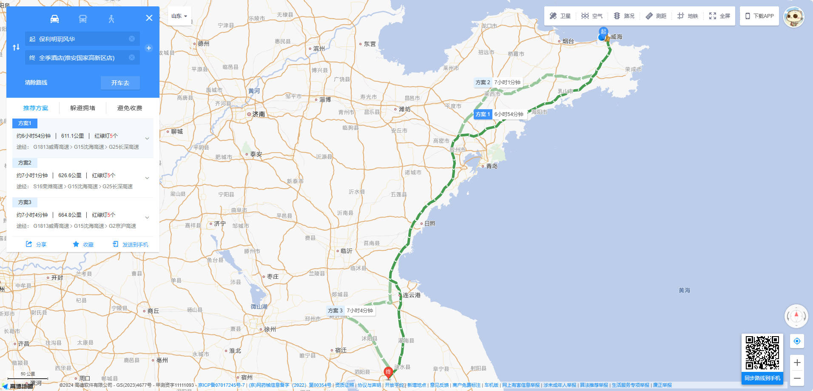

# 九华山旅行攻略

## 注意

::: warning
- 不要找导游！！！不要找导游！！！不要找导游！！！
- 带现金！！！带现金！！！带现金！！！
:::

## 自驾

### 去程

- 威海(保利明玥风华) → 淮安
  - :hotel: 全季酒店（淮安国家高新区）
  - :world_map: 江苏省淮安市淮阴区淮河路`193`号`3`号楼
  - :phone: `0517-84633888`
  
- 淮安 → 池州
  - :hotel: 全季酒店(池州青阳九华山换乘中心店)
  - :world_map: 池州市青阳县九华山柯村中心区西环旅游服务区三期九华芙蓉小镇`22`栋楼
  - :phone: `15505666073` 
  

### 返程
- 池州 → 菏泽
  - :hotel: 全季酒店(菏泽人民路店)
  - :world_map: 菏泽市牡丹区丹阳街道人民路`111`号交通未来城
  - :phone: `0530-6226666`
  
- 菏泽 → 济宁
  - :hotel: 全季酒店(三孔景区孔庙店)
  - :world_map: 济宁市曲阜市西门大街`19-1`号
  - :phone: `0537-4413666`
  
- 济宁 → 威海(保利明玥风华)
  

## 高铁/飞机

### 去程

- 高铁方案一：
  - 威海 → 南京 → 池州：
    - 威海 - 南京南        :bullettrain_front: 高铁 `D2876`  `07:19 - 14:02`
    - 南京南 - 池州        :bullettrain_front: 高铁 `G2789`  `14:53 - 16:19`

- 高铁方案二：
  - 威海 - 合肥 - 池州：
    - 威海 - 合肥南        :bullettrain_front: 高铁 `D2150` `12:38 - 20:16`
    - 合肥南 - 池州        :train: 卧铺 `K677`   `22:44 - 03:34`（次日）

- 高铁方案三：
  - 威海 - 青岛 - 池州：
    - 威海 - 青岛西        :bullettrain_front: 高铁 `G2684` `09:48 - 11:47`
    - 青岛西 - 池州        :bullettrain_front: 高铁 `D3187` `13:46 - 19:26`

- 飞机+高铁方案一：
  - 威海 → 南京 → 池州：
    - 大水泊 - 禄口        :airplane: 飞机 春秋航空`9C8743`  `16:35 - 18:20`
    - 禄口 - 南京南        :monorail: 地铁 `S1`号线(机场线)  `44分钟`
    - 南京南 - 池州        :bullettrain_front: 高铁 `G7207` `19:33 - 20:54`
    - 南京南 - 池州        :bullettrain_front: 高铁 `G7273` `20:43 - 22:08`

- 飞机+高铁方案二：
  - 威海 - 烟台 - 合肥 - 池州：
    - 威海 - 烟台         :taxi: 拼车
    - 烟台 - 合肥新桥      :airplane: 飞机 东方航空`MU9068` `10:55 - 12:45`
    - 新桥 - 合肥南        :bus:机场巴士 `3号线` `1小时11分`
    - 合肥南 - 池州        :bullettrain_front: 高铁 `G9487` `16:55 - 18:30`

- 租车
  - :office: 神州租车(池州站服务点)
  - :world_map: 池州市贵池区站前路池州上海城`A3`栋`104`
  - :phone: `19966180301`

- 住宿
  - :hotel: 全季酒店(池州火车站店)
  - :world_map: 池州市贵池区永明东路豪丰国际家居装饰城`25`号楼
  - :phone: `0566-5190888`
