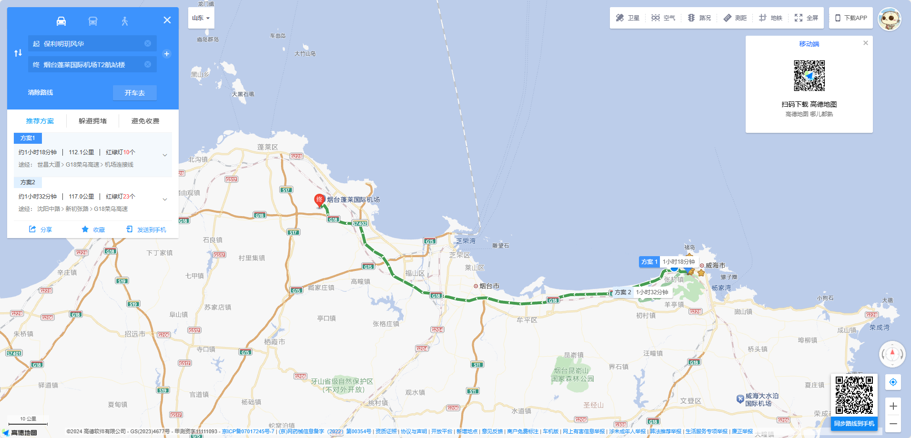
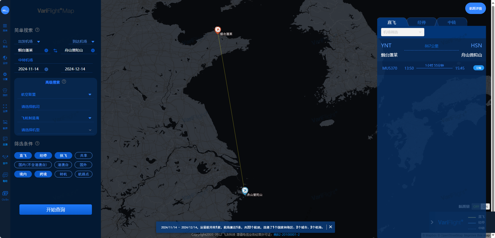

# 普陀山旅行攻略
## 注意事项
- 不要找导游！！！不要找导游！！！不要找导游！！！
- 带现金
- 多带衣服，天气不好时非常非常潮湿
- 登岛之后购买打火机

## 交通
### 去程
- 威海保利明玥风华 → 烟台蓬莱国际机场
    - 🕙 `10:00` -- `10:30`
    - 🚕 胡师傅 `15634365519`
      
    
- 烟台蓬莱国际机场 → 舟山普陀山国际机场
    - 🕑 时间：`13:50` -- `15:45`
    - ✈️ 航班：`MU5370`
    - 💺 坐号：`40K` 和 `40L`
      

- 舟山普陀山国际机场 → 朱家尖客运中心
    - 🚕 出租车
      
    
- 朱家尖客运中心 → 普陀山客运站
    - :earth_americas: 服务号：舟山海星轮船
    - :round_pushpin: 购买`普陀山大门票（全）加进岛船票（全）`
    - ⛵ 轮渡
      
    
- 普陀山客运站 → 普陀山伴山观海民宿（龙沙一区站）
    - :bus: 景区大巴（龙沙方向）
      
      
### 返程
- 普陀山伴山观海民宿（龙沙一区站） → 普陀山客运站（码头）
    - :bus: 景区大巴（码头方向）
- 普陀山客运站（码头） → 朱家尖客运中心
    - :earth_americas: 服务号：普陀山风景区
    - ⛵ 轮渡（返程船票）
- 朱家尖客运中心 → 舟山普陀山国际机场
    - 🚕 出租车
- 舟山普陀山国际机场 → 烟台蓬莱国际机场
    - 🕑 时间：`11:15` -- `12:55`
    - ✈️ 航班：`MU5369`
    - 💺 坐号：`35K` 和 `35L`
- 烟台蓬莱国际机场 → 威海保利明玥风华
    - 🚕 胡师傅 `15634365519`

## 景点
### 第一天

- 普渡禅寺
  - :bus: 龙沙始发站 → 普渡寺站
  - :triangular_flag_on_post: 普渡禅寺请香（记得带打火机）
- 南海观音
  - :walking: 普渡寺 → 南海观音

### 第二天

- 法雨寺
  - :bus: 龙沙始发站 → 索道（经停法雨寺）
- 佛心墙
  - :walking: 法雨寺 → 佛心墙
- 慧济禅寺
  - :walking: 佛心墙  → 法雨寺站
  - :bus: 法雨寺站 → 索道
  - :triangular_flag_on_post: 现场扫码购买索道往返票
  - :aerial_tramway: 索道 → 慧济禅寺
  - :triangular_flag_on_post: 佛顶山路8号购买冰箱贴（这里便宜很多）
- 宝陀讲寺
  - :aerial_tramway: 慧济禅寺 → 索道
  - :walking: 索道  → 宝陀讲寺（人很少非常的安静）

## 天气

### 威海天气

|      日期      |    天气    |  气温  |
| :------------: | :--------: | :----: |
| 2024年11月14日 | 小雨转多云 | 16/12℃ |
| 2024年11月15日 | 多云转小雨 | 18/15℃ |
| 2024年11月16日 |    小雨    | 18/10℃ |
| 2024年11月17日 |    多云    | 10/4℃  |

### 烟台天气

|      日期      |    天气    |  气温  |
| :------------: | :--------: | :----: |
| 2024年11月14日 | 小雨转多云 | 15/11℃ |
| 2024年11月15日 |  晴转小雨  | 17/12℃ |
| 2024年11月16日 |  小雨转阴  | 18/10℃ |
| 2024年11月17日 |    多云    | 11/4℃  |

### 舟山天气

|      日期      |      天气      |  气温  |
| :------------: | :------------: | :----: |
| 2024年11月14日 |    阴转小雨    | 23/19℃ |
| 2024年11月15日 | 小到中雨转小雨 | 23/18℃ |
| 2024年11月16日 |       阴       | 22/16℃ |
| 2024年11月17日 |    小雨转阴    | 19/13℃ |

## 行李

### 行李箱(托运)
<input type="checkbox" checked/><label>睡衣</label> 
<input type="checkbox" checked/><label>袜子</label> 
<input type="checkbox" checked/><label>内衣</label> 
<input type="checkbox" checked/><label>内裤</label> 
<input type="checkbox" checked/><label>梳子</label> 
<input type="checkbox" checked/><label>拖鞋</label> 
<input type="checkbox" checked/><label>晾衣架</label> 
<input type="checkbox" checked/><label>洗脸巾</label> 
<input type="checkbox" checked/><label>烧水器</label> 
<input type="checkbox" checked/><label>登山杖</label> 
<input type="checkbox" checked/><label>折叠座椅</label> 
<input type="checkbox" checked/><label>一次性床单</label> 
<input type="checkbox" checked/><label>一次性浴巾</label> 
<input type="checkbox" checked/><label>一次性马桶套</label> 

### 书包

<input type="checkbox" checked/><label>口罩</label> 
<input type="checkbox" checked/><label>抽纸</label> 
<input type="checkbox" checked/><label>湿巾</label> 
<input type="checkbox" checked/><label>雨伞</label> 
<input type="checkbox" checked/><label>牙刷</label> 
<input type="checkbox" checked/><label>保温杯</label> 
<input type="checkbox" checked/><label>刷牙杯</label> 
<input type="checkbox" checked/><label>充电器</label> 
<input type="checkbox" checked/><label>乳果糖</label> 
<input type="checkbox" checked/><label>口香糖</label> 
<input type="checkbox" checked/><label>晕船药</label> 
<input type="checkbox" checked/><label>身份证</label> 
<input type="checkbox" checked/><label>开塞露</label> 
<input type="checkbox" checked/><label>湿厕纸</label> 
<input type="checkbox" checked/><label>一次性雨衣</label> 
<input type="checkbox" checked/><label>一次性雨鞋</label> 