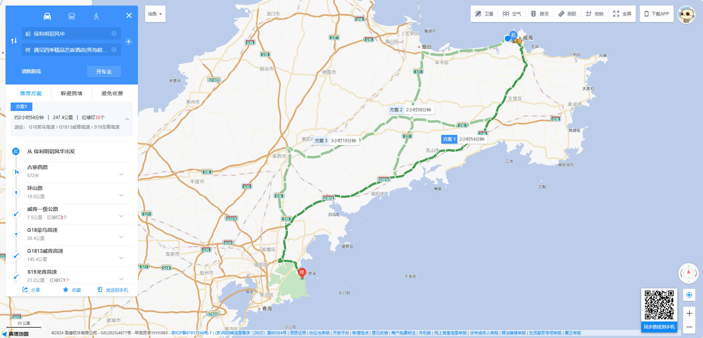

# 崂山旅行攻略

## 注意

::: warning

- 不要找导游！！！不要找导游！！！不要找导游！！！
- 带现金！！！带现金！！！带现金！！！

:::

## 交通

### 去程

#### 自驾
- 保利明玥风华 → 遇见四季精品艺宿酒店(青岛崂山风景区店)
  - :hotel: 遇见四季精品艺宿酒店(青岛崂山风景区店)
  - :world_map: 青岛市崂山区崂山景区旅游专用路仰口售检票站北`50`米
  - :phone: `13780679789`
  

#### 高铁
- 威海保利明玥风华 → 威海北站
  - :clock630: `06:30` -- `07:00`
  - :taxi: 出租车

- 威海北站 → 青岛北站
  - :clock7: `07:12` -- `08:37`
  - :bullettrain_front: 复兴号 `G6552`

### 返程

#### 自驾
- 遇见四季精品艺宿酒店(青岛崂山风景区店) → 保利明玥风华
  - :hotel: 遇见四季精品艺宿酒店(青岛崂山风景区店)
  - :world_map: 青岛市崂山区崂山景区旅游专用路仰口售检票站北`50`米
  - :phone: `13780679789`

### 高铁

- 青岛北站 → 威海北站
  - :clock6: `18:14` -- `19:45`
  - :bullettrain_front: 复兴号 `C6511`
