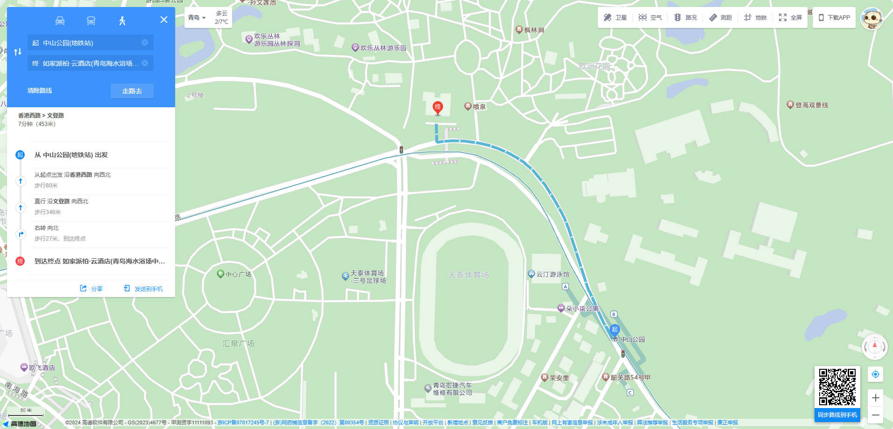

# 青岛两日游攻略

## 注意

::: warning

- 不要找导游！！！不要找导游！！！不要找导游！！！
- 带现金！！！带现金！！！带现金！！！
  :::

## 交通

### 去程

- 驾车
    - 威海保利明玥风华 → 如家派柏·云酒店(青岛海水浴场中山公园地铁站店)
        - :hotel: 如家派柏·云酒店(青岛海水浴场中山公园地铁站店)
        - :round_pushpin: 青岛市市南区文登路`26`号(中山公园地铁站`A`口步行`380`米)
        - :phone: `0532-80901999`
          

- 高铁
    - 威海保利明玥风华 → 威海北站
        - :clock630: `06:30` -- `07:00`
        - :taxi: 出租车

    - 威海北站 → 青岛北站
        - :clock7: `07:12` -- `08:37`
        - :bullettrain_front: 复兴号 `G6552`

    - 青岛北站 → 中山公园地铁站（青岛站方向）
        - :monorail: 地跌 `3`号线 `44`分钟

    - 中山公园地铁站 → 如家派柏·云酒店(青岛海水浴场中山公园地铁站店)
        - :walking: `7`分钟 `453m`
        - :hotel: 如家派柏·云酒店(青岛海水浴场中山公园地铁站店)
        - :round_pushpin: 青岛市市南区文登路`26`号(中山公园地铁站`A`口步行`380`米)
        - :phone: `0532-80901999`
          

### 返程

- 驾车
    - 如家派柏·云酒店(青岛海水浴场中山公园地铁站店) → 信号山公园停车场(出入口)
      

    - 信号山公园停车场(出入口) → 青岛湛山寺
      

    - 青岛湛山寺 → 威海保利明玥风华
      
- 高铁
    - 如家派柏·云酒店(青岛海水浴场中山公园地铁站店) → 中山公园(地铁站)
        - :clock4: `16:45` -- `17:00`
        - :walking: `7`分钟 `453m`
          

    - 中山公园(地铁站) → 青岛站
        - :monorail: 地跌 `3`号线 `11`分钟

    - 青岛站 → 威海北站
        - :clock530: `17:46` -- `19:45`
        - :bullettrain_front: 复兴号 `G6510`

    - 威海北站 → 威海保利明玥风华
        - :clock8: `20:00` -- `20:10`
        - :taxi: 出租车

## 景点
### 第一天
- 中山公园
  - :walking: 如家派柏·云酒店(青岛海水浴场中山公园地铁站店) → 中山公园
    - :fountain: 中山公园喷泉
    - :triangular_flag_on_post: 会前村遗址
    - :triangular_flag_on_post: 孙文莲池
    - :ferris_wheel: 游乐场
    - :triangular_flag_on_post: 小西湖
    - :aerial_tramway:索道中山公园站
    
- 青岛动物园
  - :walking: 中山公园 → 青岛动物园

### 第二天
- 信号山公园
  - :car: 如家派柏·云酒店(青岛海水浴场中山公园地铁站店) → 信号山公园停车场(出入口)

- 青岛湛山寺
  - :car: 信号山公园 → 青岛湛山寺
  - :triangular_flag_on_post: 带香（记得带打火机）