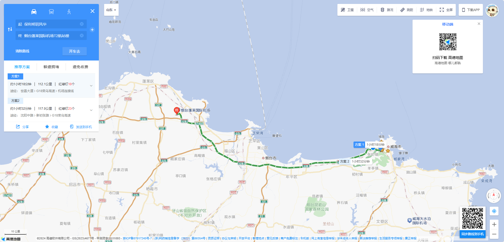
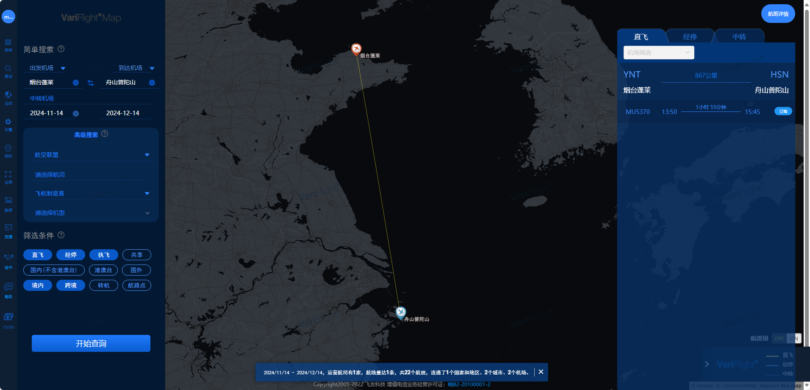
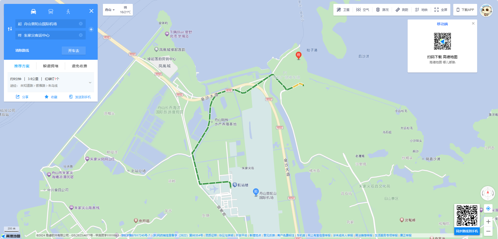
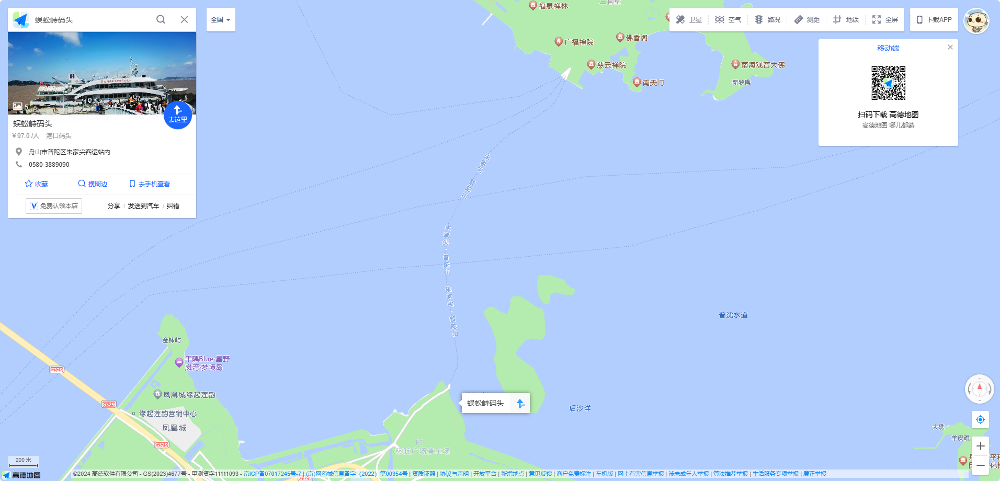
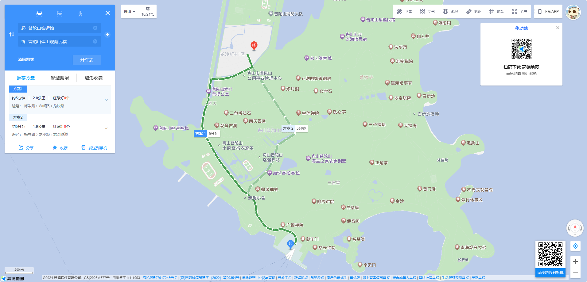

# 普陀山旅行攻略

## 旅程
::: timeline 2024-11-14
- 威海保利明玥风华 → 烟台蓬莱国际机场
- 烟台蓬莱国际机场 → 舟山普陀山国际机场
- 舟山普陀山国际机场 → 朱家尖客运中心
- 朱家尖客运中心 → 普陀山客运站
- 普陀山客运站 → 普陀山伴山观海民宿
:::

::: timeline 2024-11-15
- 普陀山伴山观海民宿 → 普济禅寺
- 普济禅寺 → 南海观音大佛
:::

::: timeline 2024-11-16
- 普陀山伴山观海民宿 → 普陀山风景名胜区
:::

::: timeline 2024-11-17
- 普陀山伴山观海民宿 → 普陀山客运站
- 普陀山客运站 → 朱家尖客运中心
- 朱家尖客运中心 → 舟山普陀山国际机场
- 舟山普陀山国际机场 → 烟台蓬莱国际机场
- 烟台蓬莱国际机场 → 威海保利明玥风华
:::

## 行程

- 威海保利明玥风华 → 烟台蓬莱国际机场
  
    - 🕙 `10:00` -- `10:30`
      
    - 🚕 胡师傅 `15634365519`
      
        
    
- 烟台蓬莱国际机场 → 舟山普陀山国际机场
  
    - 🕑 时间：`13:50` -- `15:45`
    
    - ✈️ 航班：`MU5370`
    
    - 💺 坐号：`40K` 和 `40L`
      

- 舟山普陀山国际机场 → 朱家尖客运中心
  
    - 🚕 出租车
      
        
    
- 朱家尖客运中心 → 普陀山客运站

    - :earth_americas: 服务号：舟山海星轮船
    - ⛵ 轮渡
      
        
    
- 普陀山客运站 → 普陀山伴山观海民宿
  
    - 🚕 出租车

## 天气

### 威海天气

|      日期      |    天气    |  气温  |
| :------------: | :--------: | :----: |
| 2024年11月14日 | 小雨转多云 | 16/12℃ |
| 2024年11月15日 | 多云转小雨 | 18/15℃ |
| 2024年11月16日 |    小雨    | 18/10℃ |
| 2024年11月17日 |    多云    | 10/4℃  |

### 烟台天气

|      日期      |    天气    |  气温  |
| :------------: | :--------: | :----: |
| 2024年11月14日 | 小雨转多云 | 15/11℃ |
| 2024年11月15日 |  晴转小雨  | 17/12℃ |
| 2024年11月16日 |  小雨转阴  | 18/10℃ |
| 2024年11月17日 |    多云    | 11/4℃  |

### 舟山天气

|      日期      |      天气      |  气温  |
| :------------: | :------------: | :----: |
| 2024年11月14日 |    阴转小雨    | 23/19℃ |
| 2024年11月15日 | 小到中雨转小雨 | 23/18℃ |
| 2024年11月16日 |       阴       | 22/16℃ |
| 2024年11月17日 |    小雨转阴    | 19/13℃ |

## 行李

### 行李箱(托运)
<input type="checkbox"/><label>睡衣</label> 
<input type="checkbox"/><label>袜子</label> 
<input type="checkbox"/><label>内衣</label> 
<input type="checkbox"/><label>内裤</label> 
<input type="checkbox" checked/><label>梳子</label> 
<input type="checkbox" checked/><label>雨伞</label> 
<input type="checkbox" checked/><label>拖鞋</label> 
<input type="checkbox" checked/><label>晾衣架</label> 
<input type="checkbox" checked/><label>洗脸巾</label> 
<input type="checkbox" checked/><label>烧水器</label> 
<input type="checkbox" checked/><label>吹风机</label> 
<input type="checkbox" checked/><label>登山杖</label> 
<input type="checkbox" checked/><label>折叠座椅</label> 
<input type="checkbox" checked/><label>一次性床单</label> 
<input type="checkbox" checked/><label>一次性浴巾</label> 
<input type="checkbox" checked/><label>一次性马桶套</label> 

### 书包

<input type="checkbox" checked/><label>口罩</label> 
<input type="checkbox" checked/><label>抽纸</label> 
<input type="checkbox" checked/><label>湿巾</label> 
<input type="checkbox" checked/><label>布包</label> 
<input type="checkbox" checked/><label>牙刷</label> 
<input type="checkbox"/><label>雨伞</label> 
<input type="checkbox"/><label>乳果糖</label> 
<input type="checkbox"/><label>开塞露</label> 
<input type="checkbox" checked/><label>晕船药</label> 
<input type="checkbox" checked/><label>身份证</label> 
<input type="checkbox"/><label>口香糖</label> 
<input type="checkbox" checked/><label>湿厕纸</label> 
<input type="checkbox"/><label>充电器</label> 
<input type="checkbox" checked/><label>刷牙杯</label> 
<input type="checkbox" checked/><label>空保温杯</label> 
